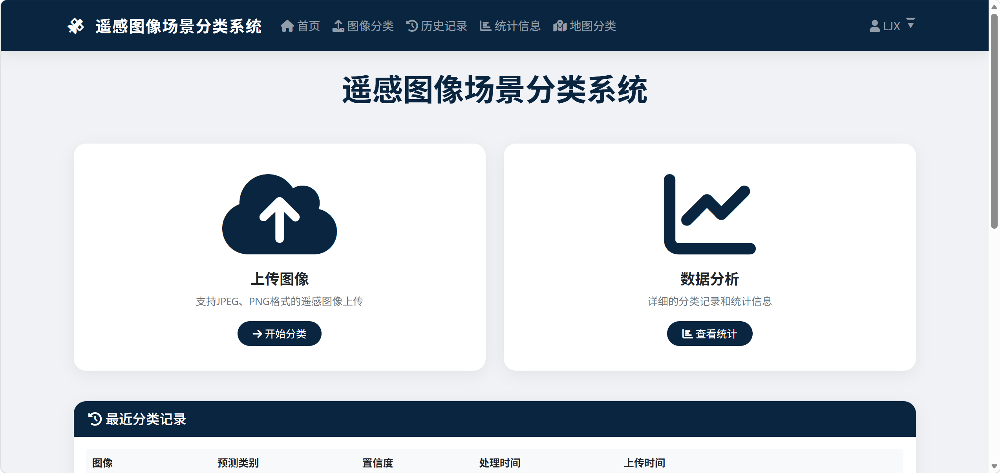
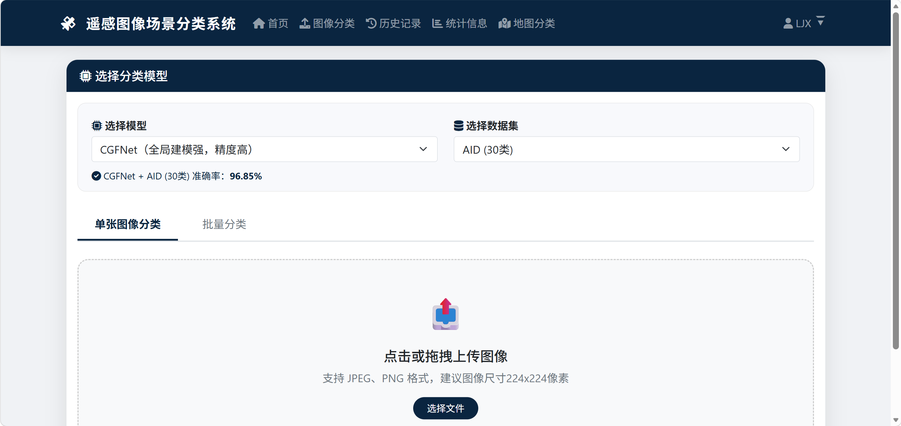
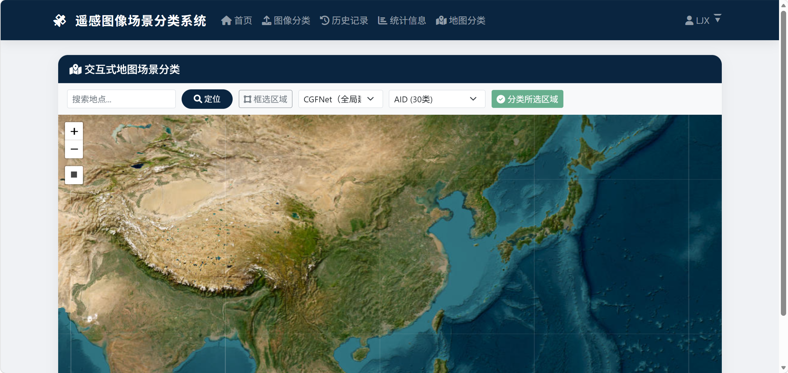

# 基于深度学习的遥感图像场景分类平台

## 功能特性


### 图像分类
- **单张分类**：上传遥感图像，选择模型和数据集，获取分类结果
- **批量分类**：支持多文件上传和 ZIP 压缩包批量处理
- **Grad-CAM 热力图**：可视化模型关注区域，解释分类依据
- **Top-5 预测**：展示前 5 个最可能的类别及确信度


### 地图交互分类
- 基于 Leaflet + ESRI 卫星影像的交互式地图
- 搜索定位：输入地名自动跳转（OpenStreetMap Nominatim 地理编码）
- 区域框选：在地图上手动框选目标区域，直接分类
- 结果自动保存到历史记录


### 双模型支持

| 模型 | 特点 | 参数量 | 适用场景 |
|------|------|--------|----------|
| CGFNet | ResNet50 + GGAM 注意力，全局建模强 | ~25M | 高精度需求 |
| LWGANet | 多尺度注意力（PA/LA/MRA/GA），轻量高效 | ~1.7M | 快速推理、部署 |

### 三数据集支持

| 数据集 | 类别数 | 类别示例 |
|--------|--------|----------|
| AID | 30 | 机场、裸地、棒球场、海滩、森林... |
| NWPU-RESISC45 | 45 | 飞机、港口、沙漠、湿地、热电站... |
| UC Merced | 21 | 农田、建筑、高速公路、河流、网球场... |

### 历史记录
- 分类记录持久化存储（MySQL）
- 多条件筛选：文件名、类别、模型、确信度、日期
- 多选导出 CSV
- 查看详情（含热力图）

### 统计分析
- 分类图像总数、平均准确率、涉及类别数
- Top-10 分类统计图表
- 每日分类趋势

## 技术栈

- **后端**：Django（Python）
- **数据库**：MySQL
- **深度学习**：PyTorch、torchvision、timm
- **前端**：Bootstrap 5、Chart.js、Leaflet.js
- **地图**：ESRI World Imagery（卫星图）、Nominatim（地名搜索）

## 快速开始

### 1. 安装依赖

```bash
pip install -r requirements.txt
```

### 2. 配置 MySQL 数据库

创建数据库并修改 `classification_system/settings.py` 中的数据库配置：

```python
DATABASES = {
    'default': {
        'ENGINE': 'django.db.backends.mysql',
        'NAME': 'remote_sensing_db',
        'USER': 'your_user',
        'PASSWORD': 'your_password',
        'HOST': 'localhost',
        'PORT': '3306',
    }
}
```

### 3. 初始化数据库

```bash
cd RS/classification_system
python manage.py makemigrations
python manage.py migrate
```

### 4. 创建管理员账户

```bash
python manage.py createsuperuser
```

### 5. 放置模型权重

将训练好的权重文件放入 `RS/classification_system/models/` 目录：

```
由于models文件较大，已放入   链接：https://pan.xunlei.com/s/VOt9hbxqI8fN3O1wWMciCb11A1?pwd=p3xz#

models/
├── best-val_acc_AID.pth          # LWGANet + AID
├── best-val_acc_NWPU.pth         # LWGANet + NWPU-RESISC45
├── best-val_acc_UCM.pth          # LWGANet + UC Merced
├── ours_resnet50_AID02_model_best.pth.tar      # CGFNet + AID
├── ours_resnet50_NWPU45_02_model_best.pth.tar  # CGFNet + NWPU
└── ours_resnet50_UCM08_model_best.pth.tar      # CGFNet + UCM
```

### 6. 启动服务

```bash
python manage.py runserver
```

访问 http://127.0.0.1:8000

## 项目结构

```
RS/classification_system/
├── classification/               # 主应用
│   ├── cgfnet_models/            # CGFNet 模型定义
│   ├── lwganet_model.py          # LWGANet 模型定义
│   ├── model_loader.py           # 模型加载与分类器
│   ├── grad_cam.py               # Grad-CAM 热力图
│   ├── views.py                  # 视图逻辑
│   ├── models.py                 # 数据库模型
│   └── urls.py                   # 路由配置
├── templates/                    # HTML 模板
│   └── classification/
│       ├── index.html            # 首页
│       ├── classify.html         # 图像分类
│       ├── map_classify.html     # 地图分类
│       ├── result.html           # 分类结果
│       ├── history.html          # 历史记录
│       ├── record_detail.html    # 记录详情
│       ├── statistics.html       # 统计信息
│       └── batch_result.html     # 批量结果
├── models/                       # 模型权重文件
├── media/                        # 上传图像与热力图
│   ├── uploads/
│   └── heatmaps/
└── classification_system/        # Django 配置
    └── settings.py
```
